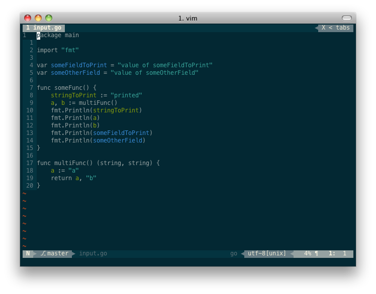

vim-gosem
================================================================================

This is a semantic highlighter for go source code files in vim. It uses
[gosem][] to do the analyzing, which uses go's built in go-parser, so it is
blazing fast, even on large files. It highlights fields, parameters and local
variables.

Screenshot with [solarized][] color scheme.

Installation
================================================================================

You need go installed to make all of this work, but since this is a tool for go
development this might not be a problem for you.

gosem
--------------------------------------------------------------------------------

To get the syntax highlighting, you first need [gosem][]. Just `go get` it:

    go get -u github.com/meonlol/gosem

This should just work. Ask aunt google to help you with your environment if it
won't. You can test gosem by navigating to some go source file on the command
line and running `gosem -f yourfile.go`. If it ouputs something like the below,
your good to go.

    someFieldToPrint someOtherField|8,16,stringToPrint a b|18,21,alocalhost

vim-gosem
--------------------------------------------------------------------------------

You know the drill! Copy-pase, away!

*  [Pathogen][]
    * `git clone https://github.com/meonlol/vim-gosem.git ~/.vim/bundle/vim-gosem`
*  [vim-plug][]
    * `Plug 'meonlol/vim-gosem'`
*  [NeoBundle][]
    * `NeoBundle 'meonlol/vim-gosem'`
*  [Vundle][]
    * `Plugin 'meonlol/vim-gosem'`

Then put this in your vimrc...

    " make vim-gosem your highlighter once you open a go source file, and refresh on save
    autocmd BufRead,BufNewFile *.go       setlocal syntax=vim-gosem
    autocmd BufWritePost *.go     silent! setlocal syntax=vim-gosem

... `source %` it and open a go source file.

[gosem]: https://github.com/meonlol/gosem
[solarized]: http://ethanschoonover.com/solarized
[Pathogen]: https://github.com/tpope/vim-pathogen
[vim-plug]: https://github.com/junegunn/vim-plug
[NeoBundle]: https://github.com/Shougo/neobundle.vim
[Vundle]: https://github.com/gmarik/vundle
